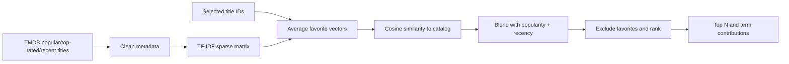
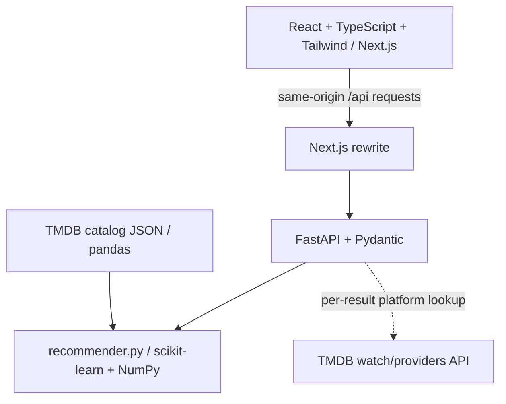

# CineMatch — Movie & Series Recommendation System

**Find your next favorite watch.** An explainable, content-based movie discovery website built with Next.js, FastAPI and scikit-learn. Choose up to five favorites and discover ten movies ranked by their actual similarity to your combined taste.

CineMatch is a beginner-friendly ML portfolio project: the recommender is small enough to study, explanations reflect the real score calculation, and an executed notebook documents the learning process. No LLM generates recommendations.

## Demo and screenshots

Local app: **http://127.0.0.1:3000** · Interactive API docs: **http://127.0.0.1:8000/docs**. No public deployment is configured.


<details><summary>Mobile screenshot</summary>


</details>

Demo script: search “Interstellar” → select it → search “Inception” → select it → **Find My Next Watch** → expand **Why this movie?** → remove Inception → generate again. The initial screen starts empty so every preference is explicitly selected.

## Movies and series update

Search and select both movies and TV series. Choose **Movies & series**, **Movies**, or **Series** under Recommend, then click **Find My Next Watch**. Filters change candidate results, while favorites may contain either type.

**v2: the catalog is now live TMDB data, not a 2018 snapshot.** The original MovieLens+TVmaze pipeline (frozen at 2018, skewed toward obscure titles with no popularity signal) has been fully replaced by [`scripts/download_tmdb.py`](scripts/download_tmdb.py), which pulls popular, top-rated, and recently-released movies and TV shows straight from [TMDB](https://www.themoviedb.org/). This needs a free TMDB API key (see below) — get one at [themoviedb.org/settings/api](https://www.themoviedb.org/settings/api). Series use a separate numeric namespace (`1,000,000,000 + TMDB TV id`) so they can never collide with movie IDs; movies keep their raw TMDB id.

Ranking now blends **content similarity (70%)** with **current popularity (15%)** and **recency (15%, exponential decay with a 6-year half-life)** — so two equally genre-matched titles will favor the one that's actually popular right now and/or recently released, instead of an arbitrary decades-old title winning purely because it shares genre words. The raw content-only score is still exposed as `content_score` for transparency, and every result's `shared_features` still sum to that content score exactly, not the final blended one.

Each of the (typically ten) titles actually returned by a request also gets a live, no-extra-cost lookup of **real streaming platforms** (`platforms`, e.g. `["Netflix", "Amazon Prime Video"]`) via TMDB's `watch/providers` endpoint, restricted to subscription ("flatrate") availability in the US region. This is a per-request lookup on the small result set, not baked into the whole catalog, so it's fast and stays current — TMDB's data reflects today's actual availability, not a fixed history.

The old curated "Netflix Originals" filter (based on a hand-picked title list and TVmaze's incomplete originals flag) has been removed along with the MovieLens/TVmaze pipeline; genuine current platform availability is now shown per-result instead.

`GET /titles/search?q=breaking` (with `/movies/search` as a compatibility alias) and `POST /recommend` (`media_type`: `all`, `movie`, `series`) both use TMDB-sourced catalog IDs now — always use IDs returned by search. Health reports movies, series and total titles from the live catalog.

**Learning baseline:** the notebook, evaluation report and the numerical walkthrough further below were built against the original 2018 MovieLens-only model and are preserved as a historical/pedagogical artifact — they no longer reflect the live app's catalog or scoring, since that catalog and the ranking formula have both changed.

## Features

- Debounced title autocomplete with keyboard navigation, cancellation, and no-result feedback.
- One to five removable favorites; guidance encourages three to five.
- Content matches blended with a popularity/recency boost, excluding selected titles, with deterministic tie-breaking.
- Real 0–1 blended scores displayed as percentages, plus a separate raw content-similarity score; no fabricated confidence.
- Live "streaming on Netflix/Prime/etc." tags per result, alongside genre overlaps and per-term score contributions in expandable explanations.
- Responsive editorial interface, original cinematic genre artwork, and accessible loading/error states.
- Real TMDB posters/synopses baked into the catalog at download time — no key needed at request time for artwork, only for the offline refresh and live platform lookups.
- `/how-it-works` educational page, executed notebook, learning guide and descriptive evaluation (documenting the original, now-superseded, MovieLens-only model).

## ML concepts and pipeline



Preprocessing normalizes punctuation/case and removes nothing content-bearing; genres are repeated three times before vectorization to emphasize them over incidental title words. This weighting is an explicit initial design choice, not an optimized result.

TF-IDF uses English stop words, Unicode accent stripping, smoothed IDF and L2 normalization. Averaging selected rows creates the taste vector; comparing only this profile to the catalog avoids a quadratic all-pairs matrix. The blended score is `0.7 × cosine + 0.15 × normalized popularity + 0.15 × recency`, clipped to `[0, 1]`; the constants live in [`recommender.py`](backend/app/recommender.py).

## Architecture and technology



Python serves the model. React owns interaction state. Data preparation, ranking, API validation, enrichment and presentation are separate. There is no database, authentication, paid model service or persistent recommendation history.

## Local setup

Prerequisites: Python **3.12+** and Node **22+**, npm, and internet access for initial dependencies/data. This project was tested with Python 3.14.6 and Node 26.5.0 on macOS. All dependencies install inside this project; no global packages are required.

From the repository root:

```bash
python3 -m venv .venv
source .venv/bin/activate
python -m pip install -r backend/requirements.txt
export TMDB_API_KEY=your_key_here   # free at themoviedb.org/settings/api
python scripts/download_tmdb.py
```

The download takes a couple of minutes and fetches ~100 pages each of popular, top-rated, and recently-released movies and TV shows (deduplicated), saved to `backend/data/tmdb_catalog.json` (git-ignored, like the old datasets were — regenerate any time with the same command). Re-run it periodically to keep recommendations current; `--pages N` widens or narrows how much of TMDB's catalog gets pulled per list.

Start the backend in terminal 1, **from the repository root** (the same `TMDB_API_KEY` must be exported here too — the backend uses it for live streaming-platform lookups):

```bash
source .venv/bin/activate
python -m uvicorn backend.app.main:app --host 127.0.0.1 --port 8000
```

Start the frontend in terminal 2:

```bash
cd frontend
npm ci
npm run dev
```

Open **http://127.0.0.1:3000**. Stop either server with Ctrl+C. Windows users can activate using `.venv\Scripts\activate` and use `python` instead of `python3`.

For a production build:

```bash
cd frontend
npm run build
npm start
```

### TMDB API key

`TMDB_API_KEY` is a **TMDB v3 API key** (not a bearer token), required in two places: `scripts/download_tmdb.py` (to build/refresh the catalog) and the backend shell (for live per-result streaming-platform lookups at request time — posters/overviews are already baked into the catalog, so they work without a key). Do not put it in a `NEXT_PUBLIC_` variable or commit it. The root `.env.example` documents the variable; Python does not automatically load `.env` files, so `export` it in whichever shell runs the script or Uvicorn.

Without a key, the app still runs against whatever catalog was last downloaded, just without live `platforms` tags on results. Failures in the platform lookup are caught and simply leave `platforms` empty; they never affect recommendations or scores. This product uses the TMDB API but is not endorsed or certified by TMDB. Review TMDB attribution/branding requirements before publicly releasing a deployment.

`frontend/.env.example` documents optional server-side `BACKEND_URL`. Copy it to `frontend/.env.local` only if changing the default backend address. Production deployment would require separately hosting Python and Next.js and configuring this value; no deployment is claimed here.

## Dataset and assets

Movie and series metadata, posters, and streaming-platform info come from [TMDB](https://www.themoviedb.org/) via its public API — genres, overviews, release dates, popularity/vote scores, and `poster_path` images are pulled directly by `scripts/download_tmdb.py` at download time (see `backend/data/tmdb-manifest.json` for the source URLs and download timestamp of the last refresh). Data terms are separate from application code; review [TMDB's API terms](https://www.themoviedb.org/documentation/api/terms-of-use) before a public deployment.

The original [MovieLens latest-small](https://grouplens.org/datasets/movielens/latest/) dataset (9,742 movies, frozen in 2018) and TVmaze's series API powered v1 of this project. They're no longer used by the running app — `scripts/download_data.py` and `scripts/download_series.py` are kept for historical reference only, since the notebook and evaluation report still document that original model.

The triptych in `frontend/public/art/cinematic-triptych.png` is original generated genre artwork, not an official film poster. Its prompt and the UI concept are documented in `docs/DESIGN.md`. Generated art is separate from the deterministic recommendation engine.

## API documentation

| Method | Endpoint | Behavior |
|---|---|---|
| GET | `/health` | Status, catalog count, vocabulary size |
| GET | `/movies/search?q=interstellar&limit=8` | Case-insensitive normalized title substring search |
| POST | `/recommend` | Ranked results and explanations |

Search requires 1–100 characters; limit is 1–20. Punctuation-only queries return an empty list. Recommend accepts 1–5 positive integer IDs and limit 1–20; duplicate IDs receive one vote. Unknown IDs return **400**; invalid types/ranges or unknown request properties return **422**. If fewer positive matches exist, fewer results are returned.

```bash
curl http://127.0.0.1:8000/health
curl 'http://127.0.0.1:8000/movies/search?q=interstellar'
curl -X POST http://127.0.0.1:8000/recommend \
  -H 'Content-Type: application/json' \
  -d '{"movie_ids":[872585],"limit":10}'
```

The response wraps `recommendations` and `model`. Each result includes `id`, `media_type`, `title`, `year`, `genres`, nullable `poster_url` and `overview`, `platforms` (live streaming providers, empty without a TMDB key or if none found), the blended `score` and the raw `content_score`, `shared_genres`, `shared_features` (term/contribution pairs that sum to `content_score`), `reasons`, `explanation`, and `selected_titles`. FastAPI’s `/docs` shows the complete generated schema.

## Actual recommendation example

Recommending from **Oppenheimer (2023)** currently surfaces recent, well-matched dramas from the last couple of years, each tagged with real platforms like `["Netflix"]` or `["Amazon Prime Video", ...]` pulled live from TMDB — since the catalog is refreshed by re-running `scripts/download_tmdb.py`, exact titles and scores shift over time by design (that's the fix for the old frozen-2018 behavior). Every result's `shared_features` still sum exactly to its `content_score`, so the taste-matching part of the ranking stays fully reconstructible; `score` additionally folds in a popularity/recency boost. Neither figure is a predicted rating or probability of enjoyment.

See [LEARNING.md](LEARNING.md) for the numerical walkthrough and [evaluation](docs/EVALUATION.md) for multiple profiles and limitations. Regenerate with:

```bash
python scripts/evaluate.py
```

## Notebook

Open `notebooks/recommender_exploration.ipynb` in VS Code or Jupyter and select the `.venv` Python interpreter. The committed notebook is executed and contains dataset inspection, missing-value handling, genre plots, text preparation, TF-IDF dimensions/weights, single/multi-favorite recommendations, a reconstructed cosine score, a full score histogram and qualitative limitations. `scripts/create_notebook.py` regenerates its unexecuted source if needed.

## Tests and checks

```bash
python -m pytest backend/tests -q
cd frontend
npm run lint
npm run typecheck
npm run build
```

Tests cover search, result count, ordering, exclusion, deduplication, score range, the content/popularity/recency blend, invalid IDs/types/limits, health, and optional/failed platform lookups — all against a small synthetic catalog built in-test, so the suite needs no TMDB key or downloaded data. Browser verification covers search → multiple favorites → recommendations → explanation → remove → regenerate, plus mobile layout, keyboard search and the educational page. Screenshots above are from the running app (pre-dating the TMDB catalog switch). See `docs/QA.md` for verification details and limitations.

## Project structure

```text
frontend/
  app/                 Routes, shared layout and design styles
  components/          Discovery, autocomplete and movie cards
  lib/api.ts           Typed API calls
  types/movie.ts       Movie and recommendation contracts
  public/art/          Original illustrative art
backend/
  app/data.py          Catalog loading and preprocessing
  app/recommender.py   TF-IDF, popularity/recency blend, explanations
  app/schemas.py       Pydantic contracts
  app/main.py          FastAPI endpoints and startup
  app/enrichment.py    Live per-result streaming-platform lookups
  data/                Downloaded catalog JSON and manifest (git-ignored)
  tests/               API and algorithm tests (synthetic catalog, no key needed)
notebooks/             Executed learning notebook (documents the original MovieLens-only model)
scripts/               download_tmdb.py (live), plus legacy MovieLens/TVmaze scripts kept for history
docs/                 Design, screenshots and evaluation evidence
README.md              Setup and portfolio overview
LEARNING.md            Beginner guide and interview preparation
```

## Limitations and future versions

Content similarity can create a similarity bubble. Movies need metadata, the catalog is dated, and genres/titles miss tone, acting and quality. Rare terms and sequels may dominate; equal genre vectors can tie. The system does not learn from other users or store preferences. Genre overlap is a circular sanity check, not independent accuracy; there is no held-out relevance benchmark or claim of user satisfaction.

- **V2:** Collaborative filtering using MovieLens ratings, with a proper held-out evaluation.
- **V3:** A hybrid recommender combining content and collaborative scores, calibrated against relevance judgments.
- **V4:** Accounts and persistent recommendation history, with deliberate data/privacy design.

## What I learned

The strongest portfolio story is the connection between feature choices and behavior: inspecting the IMAX failure, keeping sparse vectors, averaging favorites fairly, distinguishing similarity from probability, deriving explanations from term products, and testing model behavior separately from HTTP/UI behavior. Before claiming this as your own learning, run the notebook, change a genre weight, explain the resulting differences and record your experiment. [LEARNING.md](LEARNING.md) gives an exact study order and ten interview questions.

Primary references: [scikit-learn TF-IDF](https://scikit-learn.org/stable/modules/generated/sklearn.feature_extraction.text.TfidfVectorizer.html), [cosine similarity](https://scikit-learn.org/stable/modules/generated/sklearn.metrics.pairwise.cosine_similarity.html), [Next.js rewrites](https://nextjs.org/docs/app/api-reference/config/next-config-js/rewrites), [TMDB details](https://developer.themoviedb.org/reference/movie-details).
